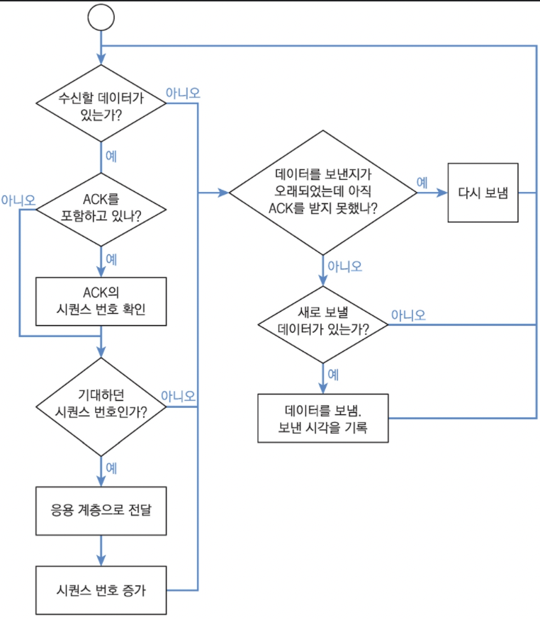

- TCP/IP 스택
- 인터넷 통신에 필요한 프로토콜과 표준

## 서킷 스위칭과 패킷 스위칭

- 서킷 스위칭
  > 하나의 회선을 할당 받아 데이터를 송수신
  - 통신을 위해서 연결을 하고 회선 전체를 독점한다.
- 패킷 스위칭
  > 데이터를 패킷 단위로 쪼개서 내용을 저장 후 전달
  - 회선을 공유하기 떄문에 가용성이 높다.

---

## TCP/IP 스택

- 각 계층을 추상화하고, 계층마다 목적에 따라 프로토콜을 갈아 끼운다.
  > 각 계층은 인터페이스, 그 인터페이스를 구현해 구체화한 것이 프로토콜로 봐도 무방
- 데이터 송수신 절차 과정
  1. 윗단 계층에서 데이터 수신
  2. 계층 헤더(+푸터)를 추가해 패킷을 조립
  3. 아랫단 계층으로 전달 및 송신 과정
  4. 다른 노드의 아랫단 계층에서 데이터를 수신
  5. 헤더를 제거 후 데이터의 패킷을 해체
  6. 윗단 계층으로 전달 및 수신 처리
- | 계층 |      OSI(비표준)       |   TCP/IP(표준)    |
  | :--: | :--------------------: | :---------------: |
  |  7   |   응용(Application)    |                   |
  |  6   |   표현(Presentation)   |                   |
  |  5   |     세션(Session)      | 응용(Application) |
  |  4   |    전송(Transport)     |  전송(Transport)  |
  |  3   |   네트워크(Network)    | 네트워크(Network) |
  |  2   | 데이터 링크(Data link) |    링크(Link)     |
  |  1   |     물리(Physical)     |  물리(Physical)   |

### 물리(Physical) 계층

- 물리적 연결을 담당
- 프로토콜 ex) 전화선, 각 종류의 케이블 등

### 링크(Link) 계층

- 물리 계층과 매우 밀접하게 연관되어 있으므로 어떤 모형에서는 하나의 계층으로 보기도 한다.
- MAC 주소를 사용
  > `MAC 주소`: NIC(Network Interface Controller)마다 부여되는 주소
- 송수신 단위: 프레임(Frame)
- 역할
  - 목적지에 주소를 부여해서 호스트를 식별할 수단 제공
  - 수신 측 주소와 프레임 포맷 정의
  - 프레임의 최대 길이 정의
  - 물리적 전기 신호로 변환하는 방법 제공
- 프로토콜 ex) 이더넷(Ethernet), 와이파이(Wifi), ARP(Address Resolution Protocol): IP -> MAC 주소 결정

### 네트워크(Network) 계층

- MAC 주소로만 통신하기에는 무리가 있다.
  > 여러 호스트가 하나의 MAC 주소를 가진 호스트에 접속했다가 해당 호스트의 NIC가 고장이 나서 MAC 주소가 변경되면 큰일이다.
- IP 주소를 사용
- 역할
  - 원격 네트워크상 서로 멀리 떨어진 호스트 사이의 통신을 촉진
- 프로토콜 ex) NAT

#### NAT(Network Address Translation)

- 인터넷 공유기 장비가 있을 경우에 서브넷 안의 전체 호스트를 단 하나의 공인 IP로 연결 가능하게 하는 기술: 사설 IP -> 공인 IP
- 각 Peer끼리 NAT를 거쳐 서로 통신할 때 문제가 생긴다.
  > `포트 포워딩`, `홀 펀칭`으로 해결
  - 포트 포워딩
    > 직접 공유기 설정을 변경
  - STUN(Session Traversal Utilities for NAT)= 홀 펀칭
    > 공인 IP가 있는 Relay(중개) 서버를 이용해 서로 연결

### 전송(Transport) 계층

- IP 패킷을 받았을 경우, 이를 어느 프로세스에 넘겨서 처리할 지를 알아야 하기 떄문에 포트(Port)를 도입
  > 특정 포트(Port)에 바인딩(Binding)된 프로세스를 찾을 수 있다.
- 만약, 두 프로세스가 하나의 포트에 바인딩하려면 특별한 플래그(Flag)를 설정해야 한다.
- 16 bits 포트

  - 0 ~ 1023: 시스템 포트(= 예약 포트)
    > root-level의 프로세스만 가능
  - 1024 ~ 49151: 사용자 포트(= 등록 포트)
    > 응용 프로그램 개발자는 사용 요청 가능
  - 49152 ~ 65535: 동적 포트
    > 어떤 프로세스가 쓰던 간에 제약 없음

#### UDP(User Datagram Protocol)

- 경량화된 프로토콜이므로 빠르다.
- 연결 유지 X: 데이터 그램을 주고 받음
- 순서 보장 X, 전달 보장 X

#### TCP(Transmission Control Protocol)

- UDP에 비해선 느리다.
- 연결 유지 O: 데이트 스트림을 주고 받음
- 순서 보장 O: 시퀀스 번호 확인
- 전달 보장 O: Ack 전달
- |                   TCP 전송 순서도                    |
  | :--------------------------------------------------: |
  |  |

### 응용(Application) 계층

- 게임 코드를 작성할 때의 계층

- 프로토콜 ex)
  - DHCP
    > 사설 네트워크 안의 IP 주소를 동적으로 할당
  - DNS
    > 도메인 주소를 IP 주소로 해석

---
