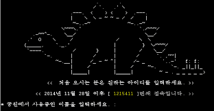
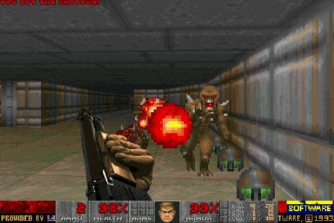
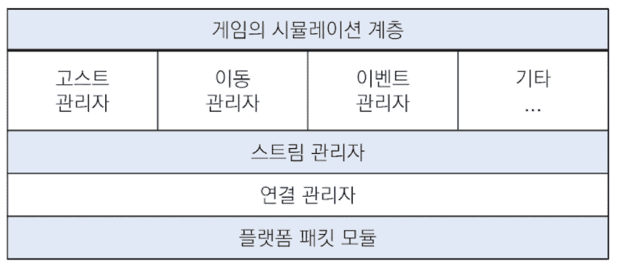

- 네트워크 멀티플레이의 개념은 대중적으로 받아들여진 것은 1990년대 이후이다.
- 1970년대 초기 네트워크부터 지금의 대규모 산업으로 이르기까지의 역사를 소개.
- 1990년대 대표 네트워크 게임: `스타시즈: 트라이브스`와 `에이지 오브 엠파이어`의 아키텍처를 소개.

## 멀티플레이어 게임의 간추린 역사

1. 로컬 멀티플레이어 게임(1958~)

   - 초창기 비디오 게임.
   - 한 대의 컴퓨터에 둘 이상의 플레이어가 같이 즐길 수 있게 고안됨

2. 초기 네트워크 멀티플레이어 게임(1973~)

   - 둘 이상의 컴퓨터가 각각 연결되어 게임 세션을 이룬다.
     > ex. Age of empire(에이지 오브 엠파이어)

3. 멀티 유저 던전, MUD(Multi-User Dungeon) 게임(1987~)

   - 보통 텍스트 기반 게임.
   - 여러 플레이어가 같은 가상 공간에 서로 동시에 접속해 즐기는 형태의 멀티플레이어 게임
   - |     ex. 쥬라기 공원(MUD)      |
     | :---------------------------: |
     |  |

4. 랜, AN(Local Area Network) 게임(1993~)

   - 가까운 지역 내에서 서로 연결된 컴퓨터의 네트워크 게임
   - |          ex. Doom(둠)           |
     | :-----------------------------: |
     |  |

5. 온라인 게임(1996~)

   - 대형 통신망을 통해 멀리 떨어진 컴퓨터끼리 연결해 플레이하는 것
     > ex. Quake(퀘이크), Unreal(언리얼)

6. MMO 게임(1997~)

   - 하나의 게임 세션에 수백, 수천, 수만 명의 플레이어가 동시에 참여
     > ex. Ultima online(울티마 온라인), Everquest(에버퀘스트), World of warcraft(월드 오브 워크래프트)

7. 모바일 네트워크 게임(2009~)
   - 보통 비동기식(턴제)으로 구현.
     > Words with friends(워즈 위드 프렌즈)

---

## 스타시즈: 트라이브스

- 1998년 말에 출시된 SF 장르의 FPS 게임.
- 당시에는 인터넷을 전화 접속으로 하던 시절.
- 효율성 문제로 비신뢰성(UDP) 프로토콜을 사용.
  > 네트워크로 보낸 데이터가 도착한다는 보장이 없음.

### 데이터 전송 구분

- |          전달 미보장 데이터          |                 전달 보장 데이터                  |        최신 상태 데이터        |           특급 전달 보장 데이터           |
  | :----------------------------------: | :-----------------------------------------------: | :----------------------------: | :---------------------------------------: |
  | 게임에서 그다지 중요하지 않은 데이터 | 게임에서 중요하고, 수신과 순서 보장 가능한 데이터 | 최신 상태여야 의미 있는 데이터 | 최우선으로 보내야 하고 가장 중요한 데이터 |
  |                                      |        ex) "Player가 총을 발사했다" 이벤트        |        ex) Player의 HP         |          ex) Player의 위치 정보           |

### 클라이언트-서버 모델을 사용

- |                    네트워킹 모델                    |
  | :-------------------------------------------------: |
  |  |
- "플랫폼 패킷 모듈"
  - 유일하게 플랫폼에 종속적인 계층
  - 표준 소켓 API를 래핑(Wrapping)
- "연결 관리자"
  - 두 컴퓨터 사이의 연결을 추상화
  - DSN(Delivery Status Notification) 보장: 맡긴 패킷이 전달되었는지 여부 전달
    > ack에 따라 비트 필드를 이용한 `sliding window` 기법으로 구현
- "스트림 관리자"
  - 어떤 데이터(이동, 이벤트, 고스트)를 보낼지 결정한 후 "연결 관리자"에 전달 후, 각 상위 관리자들에게 전달되었는지 알려줌
  - 최대 데이터 전송률, 전송 주기, 패킷 크기 조절
    > 트라이브스의 논문에서는 사용자가 28.8 kbps 모뎀을 쓰는 경우 초당 2KB 정도 패킷 전송률을 잡는다.
  - 데이터 전송 요청의 우선순위를 관리
    > 대역폭이 제한된 상황의 우선순위: "이동 관리자" > "이벤트 관리자" > "고스트 관리자"
- "이벤트 관리자"
  - 게임 시뮬레이션 중 발생하는 이벤트의 대기열을 관리(= 간이 RPC=Remote Procedure Call)
  - 각 이벤트의 우선순위를 결정
- "고스트 관리자"
  - 특정 클라이언트에게 유의미하다고 느껴지는 동적 객체를 복제해 고스트를 만든다.
    > `고스트`: 클라이언트가 서버에서 받아둔 여러 객체 정보
  - 고스트 전송 or 수신해 모든 클라이언트가 가장 최신의 상태로 업데이트 되게끔 보장
- "이동 관리자"
  - 플레이어의 이동 데이터를 최대한 빨리 전송, 갱신
- "기타 시스템"
  1. "데이터 블록 관리자": 비교적 정적인 편에 속하는 게임 객체의 전송

---

## 에이지 오브 엠파이어

- 1997년에 출시된 실시간 전략 게임
- Deterministic lock-step 모델을 사용
- P2P 방식으로 연결되며, 모든 피어가 각각 동시에 시뮬레이션을 진행

### 턴 타이머 사용

- 일정 기간마다 명령을 쌓아두고, 정해둔 타이머 길이가 완료되면 각 클라이언트에 전송하는 방식
- 에이지 오브 엠파이어의 경우
  - 턴 길이를 200ms로 잡았다.
    > 200ms 동안 내린 모든 명령은 대기열 버퍼에 쌓이다가 200ms가 완료되면 모든 다른 플레이어게 전송된다.
  - 명령 수신 측의 클라이언트는 두 번의 턴이 지난 후 해당 명령을 처리한다.
    > 200ms 턴 타이머의 경우, 인풋 렉까지 최대 600ms 지연 시간이 생긴다.
  - 만약, 플레이어 한 명이 200ms 타이머조차 못 따라간다면 해당 플레이어를 내보내거나, 해당 플레이어의 렌더링 프레임 레이트를 동적으로 조절해 네트워크 데이터 수신에 시간을 더 할애한다.

### 동기화: 유사 난수 발생기(Random) 이용

- 같은 Random API를 쓰고, Seed 값만 일치하면 모든 피어가 같은 결과를 얻을 수 있다.
- 대신, 단 한 번이라도 서로 다른 횟수로 호출하면 동기화가 어긋난다.
  > 동기화가 어긋난 플레이어를 감지 가능하기 때문에 동기화와 관련된 일반적인 치트가 힘들다.
- 동기화와 관련되지 않는 "맵핵"을 치트는 막기 어려움.

---
